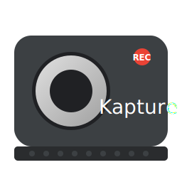

# Kapture Screen Recorder

A simple, native Wayland screen recorder built with C, GTK4, and GStreamer.



## Prerequisites

Before running or building the application, ensure you have the necessary dependencies installed.

### Runtime Dependencies
These packages are required to run the application:

```bash
sudo apt update
sudo apt install libgtk-4-1 gstreamer1.0-plugins-base gstreamer1.0-plugins-good \
gstreamer1.0-plugins-bad gstreamer1.0-plugins-ugly gstreamer1.0-libav \
gstreamer1.0-pipewire gstreamer1.0-tools
```

### Development Dependencies
These packages are required if you want to compile or modify the source code:

```bash
sudo apt install build-essential libgtk-4-dev libgstreamer1.0-dev \
libgstreamer-plugins-base1.0-dev
```

## How to Build

To compile the application from source, simply run `make` in the project directory:

```bash
make
```

This will generate the `kapture-screen-recorder` executable.

## How to Run

You can run the compiled application directly from the terminal:

```bash
./kapture-screen-recorder
```

## Features

*   **Wayland Support:** Uses XDG Desktop Portals for secure screen capture.
*   **Audio Recording:** Record microphone, system audio, or a mix of both.
*   **Multiple Formats:** Supports MKV, MP4, WebM, AVI, and MOV.
*   **High Performance:** Includes options for raw/lossless recording and optimized buffering.
*   **Pipeline Editor:** View and edit the underlying GStreamer pipeline for advanced control.

## Packaging

To build a Debian package (.deb) with the icon included, run the packaging script:

```bash
chmod +x package_deb.sh
./package_deb.sh
```